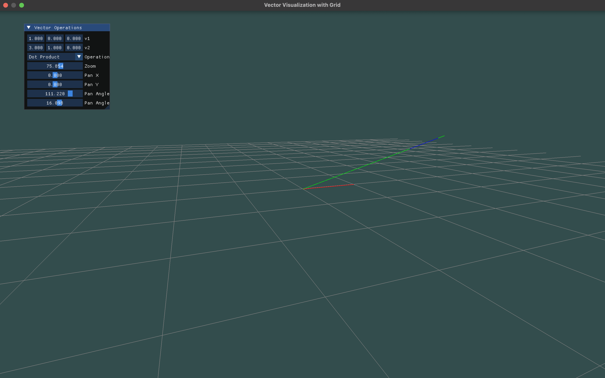
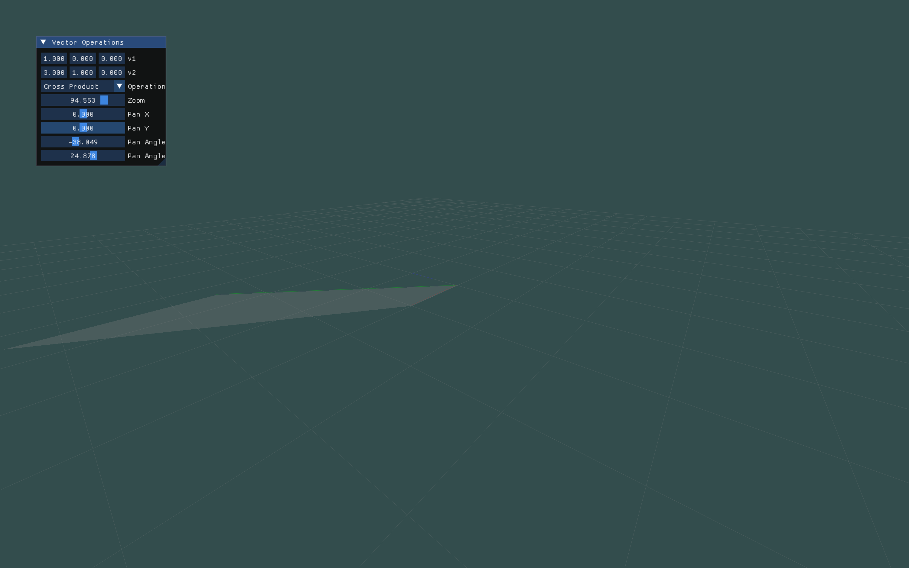

# Vector Visualization with OpenGL and ImGui

This project provides a simple OpenGL application to visualize vectors and perform vector operations such as dot products and cross products. The application displays vectors in 3D space on a grid, allowing you to manipulate the view and zoom in/out using ImGui controls.

## Features
- **Grid Visualization:** Displays a 3D grid to visualize vectors and coordinate space.
- **Vector Operations:** 
  - **Dot Product**: Displays the result of the dot product between two vectors.
  - **Cross Product**: Displays the cross product of two vectors, along with the parallelogram formed by the two input vectors.
- **Camera Control**: Pan and zoom using sliders provided in the ImGui interface.
- **Interactive GUI**: Adjust vector values, camera zoom, and pan angles via an interactive ImGui window.

### Dot Product Visualization:


The image above shows the result of the dot product calculation between two vectors. The scalar result is displayed and can be manipulated through the GUI.

### Cross Product Visualization:


The image above illustrates the cross product of two vectors. The parallelogram formed by the vectors is highlighted, providing an intuitive view of the cross product's geometric interpretation.

## Requirements

To build and run this project, you will need the following:

- **OpenGL** (3.3 or higher)
- **GLFW** for window and input management
- **GLEW** for OpenGL function loading
- **GLM** for mathematical operations (vectors, matrices)
- **ImGui** for GUI rendering
- **CMake** for building the project (optional but recommended)

### Libraries to Install:
1. **GLFW**: Used to create the window and handle input.
2. **GLEW**: To handle OpenGL function pointers.
3. **GLM**: A mathematics library that provides vector and matrix operations.
4. **Dear ImGui**: A bloat-free graphical user interface library for rendering interactive components.

You can install these dependencies using your platform’s package manager or manually include them in your project.

### Installing Dependencies on macOS (Homebrew):
```bash
brew install glew glfw glm
```

### Installing Dependencies on Linux (Ubuntu/Debian):
```bash
sudo apt-get install libglew-dev libglfw3-dev libglm-dev
```

### Installing Dependencies on Windows:
- You can download the libraries manually or use package managers like `vcpkg` or `choco` to install them.

## How to Build

### Using CMake (Recommended)

1. Clone this repository:
    ```bash
    git clone https://github.com/mnshah0101/VectorVisualizationCpp
    cd VectorVisualizationCpp
    ```

2. Create a build directory and configure the project:
    ```bash
    mkdir build
    cd build
    cmake ..
    ```

3. Build the project:
    ```bash
    cmake --build .
    ```

4. Run the executable:
    ```bash
    ./VectorVisualization
    ```

### Manual Compilation

You can compile the project manually if you are not using CMake. For example:

```bash
g++ -std=c++11 -o VectorVisualization main.cpp -lGLEW -lglfw -lGL -lGLM -limgui
```

Adjust the above compilation command according to your platform and compiler settings.

## How to Use

1. Once you run the application, a window will appear displaying a grid and an interactive ImGui window.

2. Use the ImGui controls to input values for two vectors:
    - **v1**: The first vector
    - **v2**: The second vector

3. Choose the operation you want to visualize:
    - **Dot Product**: Displays the dot product result and a vector scaled by the dot product.
    - **Cross Product**: Displays the cross product and the parallelogram formed by the two vectors.

4. Adjust the camera view:
    - **Zoom**: Zoom in and out of the scene.
    - **Pan X** and **Pan Y**: Adjust the position of the camera.
    - **Pan Angle X** and **Pan Angle Y**: Rotate the view along the horizontal and vertical axes.

## Controls

- **Escape**: Close the application.
- Use the sliders in the ImGui window to adjust the vectors and view.

## License

This project is licensed under the MIT License. Feel free to modify and distribute.

## Credits

- OpenGL for rendering.
- GLFW for window management.
- GLEW for handling OpenGL extensions.
- GLM for mathematics.
- Dear ImGui for the user interface.

